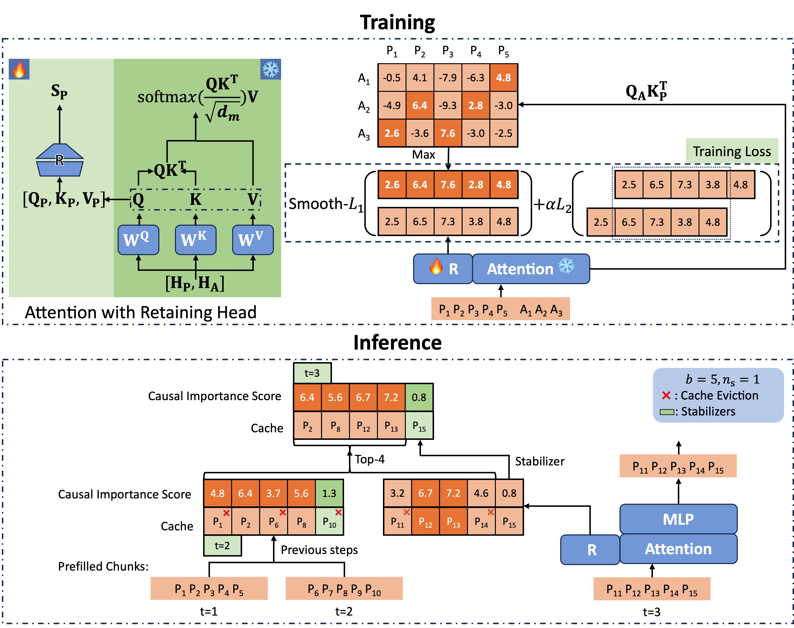
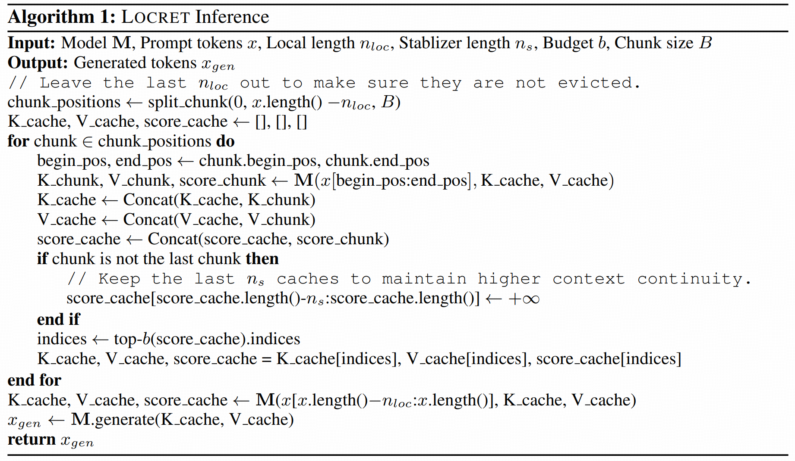

<div align="center">

<h1>Locret: Accelerating Long-Context LLM Inference with Retaining Heads</h1>

<p align="center">
<a href="https://huangyuxiang03.github.io/blogs_locret" target="_blank">Blog</a> |
<a href="TODO" target="_blank">Paper (ArXiV)</a> 
</a>
 
</p>

**A Light-weight Training-based KV Cache Compression Algorithm**
</div>

Locret is a light-weight training-based KV cache eviction method, which achieves **20x** and **8x** KV cache compression ratio for Phi-3-mini-128K and Llama-3.1-8B-instruct, enabling **128K+** long-context inference on **a single Nvidia 4090 GPU**.

##
<div align="center">
<h4>This project was made possible thanks to a collaboration with </h4>
</div>

##


## Design

### Overall Framework



### Locret Inference



## Usage

Note that we only support Phi-3-mini-128K and Llama-3.1-8B-instruct currently. More models will be supported in the future.

### Environment Setup

Run the following command, and the environment will be set up automatically.

```bash
cd locret
conda env create -f locret_env.yaml
conda activate locret_env
pip install -e .
```

Official checkpoints of Locret can be downloaded from [hyx21/Locret-phi-3-mini-128K](https://huggingface.co/hyx21/Locret-phi-3-mini-128K) and [hyx21/Locret-llama-3.1-8B-instruct](https://huggingface.co/hyx21/Locret-llama-3.1-8B-instruct).

Now you are all set!

### Training

First, enter the working directory by
```bash
cd locret/train
```

Then, generate the training dataset. Run the following command.
```bash
python data_gen.py --model_dir <model_dir>
```

Finally, start training the model.
```bash
python train.py --model_dir <model_dir>
```

All the hyperparameters are set automatically according to our paper. Please indicate the model you use in `model_dir`, i.e. if there is a `phi` in the path, the training script can detect that.

After the training process, you will be getting the trained checkpoint at `locret/train/checkpoints/<model_name>`. You can directly load the complete model after `save_pretrained` or only load the retaining heads. We provide a script, `locret/train/convert.py`, to convert checkpoints saved in safetensors format to pytorch format.

### Inference

Here, we provide an example of one entry in R.PassKey of InfiniteBench in `example.py`. To run the example, you can execute 
```bash
python example.py --model_dir <model_dir> # for saved full checkpoint, or
python example.py --model_dir <model_dir> --retaining_head_path <*.bin> # original model + saved retaining heads
```

For other experiments in our paper, please run the codes in `benchmark/infinite_bench` and `benchmark/LEval-main`. Each script correspond to an experimental setting, which can be recognized through the script name. 

## Develop Roadmap 

- [ ] Add support to Llama-3.2-1B and Llama-3.2-3B
- [ ] Add support to MiniCPM-2.4B and MiniCPM-1.2B
- [ ] Add support to Qwen-2.5-1.5B and Qwen-2.5-1.5B


## Citation

Please cite our [paper](TODO) if you find our work valuable.

```
@article{huang2024locret,
  title={Locret: Accelerating Long-Context LLM Inference with Retaining Heads},
  author={Yuxiang Huang, Binhang Yuan, Xu Han, Chaojun Xiao, Zhiyuan Liu},
  journal={arXiv preprint arXiv:TODO},
  year={2024}
}
```

## Acknowledgement

We acknowledge the discussion with Ruisi Cai@UT Austin, the author of LoCoCo, for the implementation of LoCoCo. We deeply thank Xinrong Zhang@Tsinghua for details in InfiniteBench, Weilin Zhao@Tsinghua for system implementation advices, Chenyang Song@Tsinghua for model sparsity, Shuo Wang@Tsinghua for long-context training recipe and Yuan Yao@NUS for future works on multimodal LLMs.
